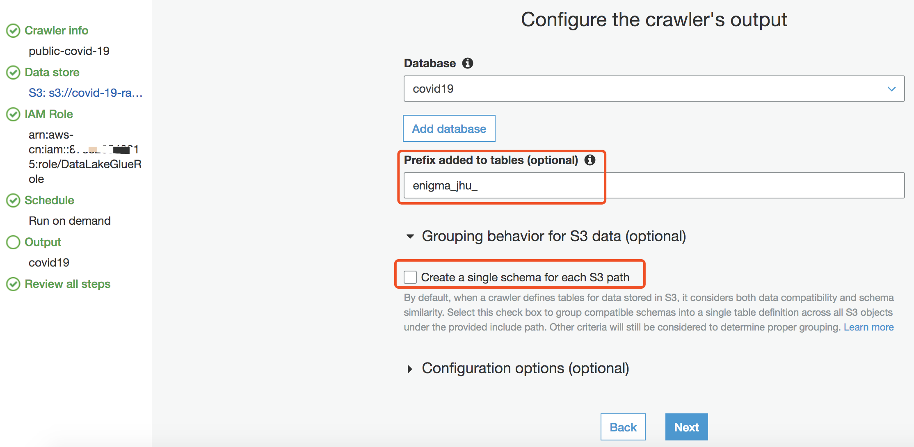
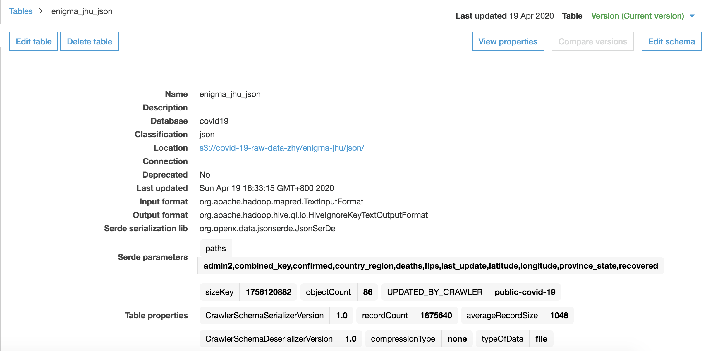
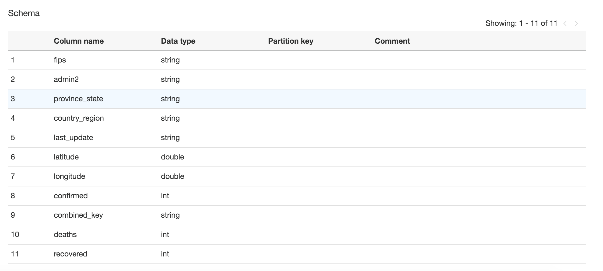
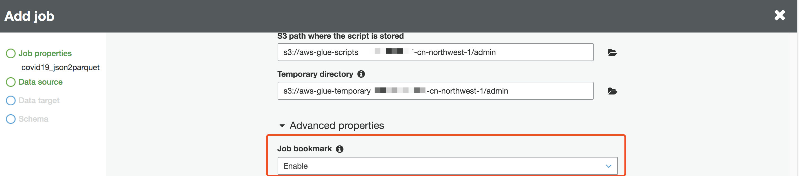
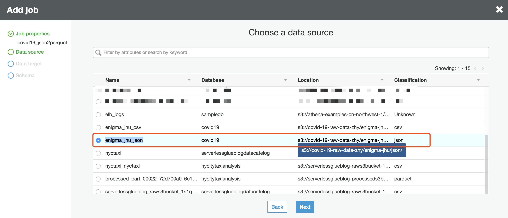
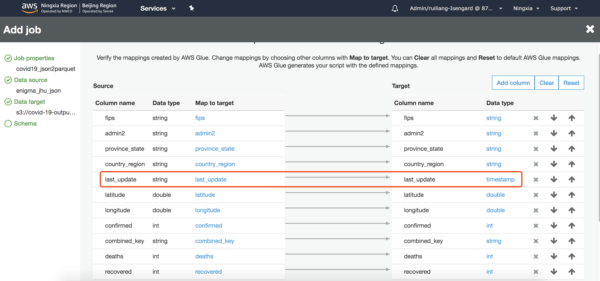
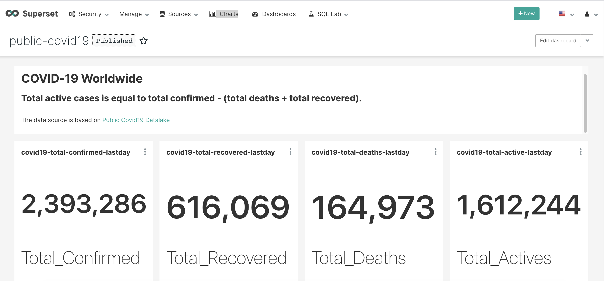

# 用于分析COVID-19数据的AWS公共数据湖示例

该数据湖由公共可读的 Amazon S3 存储桶（s3://covid19-lake）中的数据组成。 本文章显示了如何通过AWS Glue 数据目录为该数据设置表格定义，以将其公开给分析引擎。 然后使用无服务器 SQL 查询引擎 Amazon Athena 查询 AWS COVID-19 数据。最后利用Apache Superset 进行可视化分析和仪表盘展示。

[COVID-19 AWS 公共数据湖介绍](https://aws.amazon.com/cn/blogs/big-data/a-public-data-lake-for-analysis-of-covid-19-data/)

|表名 / S3 桶路径	| 描述	| 数据源| 关键字段 |
| :-----| :-----| :-----| :-----|
|s3://covid19-lake/enigma-jhu/ | 全球新冠肺炎 (COVID-19) 数据 | 约翰.霍普金斯大学 | 累计确诊 / 死亡 / 治愈 / 地理信息 / 更新时间

## 浏览数据集
```bash
# AWS S3 命令行
aws s3 ls s3://covid19-lake/ --profile us-east-1

# 你也可以用 S3 浏览器进行浏览
https://github.com/awslabs/aws-js-s3-explorer
```

## 同步AWS COVID-19 公共数据湖数据到您账号的 S3 桶
使用工具 [amazon-s3-resumable-upload toolkit](https://github.com/aws-samples/amazon-s3-resumable-upload) 同步AWS COVID-19 公共数据湖数据到您账号的 S3 桶

命令步骤
```bash
# 请先安装 AWS CDK 然后由 CDK部署。CDK 文档可参照官网：
https://docs.aws.amazon.com/cdk/latest/guide/getting_started.html

# 克隆工具
git clone git@github.com:aws-samples/amazon-s3-resumable-upload.git
cd amazon-s3-resumable-upload/serverless/enhanced-lambda-jobsender
pip install -r requirements.txt

export AWS_DEFAULT_REGION=us-east-1

## 手工配置 System Manager Parameter Store， 新增参数: 名称：s3_migration_credentials, 层级: Standard, 类型: SecureString, 参数值：
{
  "aws_access_key_id": "your_aws_access_key_id",
  "aws_secret_access_key": "your_aws_secret_access_key",
  "region": "cn-northwest-1"
}

## 编辑目录下 AWS CDK app.py 文件，设置 S3 桶信息
bucket_para = [{
    "src_bucket": "covid19-lake",  # The bucket in US
    "src_prefix": "enigma-jhu",
    "des_bucket": "covid-19-raw-data-zhy", # The bucket in China
    "des_prefix": ""
}, {
    "src_bucket": "covid19-lake",  # The bucket in US
    "src_prefix": "enigma-jhu-timeseries",
    "des_bucket": "covid-19-raw-data-zhy",  # The bucket in China
    "des_prefix": ""
}, {
    "src_bucket": "covid19-lake",
    "src_prefix": "static-datasets",
    "des_bucket": "covid-19-raw-data-zhy",
    "des_prefix": ""
}]

StorageClass = 'STANDARD'
alarm_email = "alarm_your_email@email.com"

# 部署工具扫描和同步目标桶与源桶数据
cdk deploy --profile ${AWS_GLOBAL_PROFILE} --outputs-file "stack-outputs.json"
```

## 通过 AWS Glue 数据目录浏览数据
### 创建一个 AWS Glue 爬虫 以自动爬取S3桶数据，创建表定义和填充 AWS Glue 数据目录

1. 根据文档 [Congfiure Glue Crawlers](https://docs.aws.amazon.com/glue/latest/dg/crawler-configuration.html) 创建一个名称为 `public-covid-19` 的 AWS Glue 爬虫程序 

- 将数据存储点配置到S3存储桶 `covid-19-raw-data-zhy`


- 配置输出为 `covid19` AWS Glue 数据目录的数据库表

注意设置: `Create a single schema for each S3 path` 为 `true`



- `public-covid-19` AWS Glue 爬虫程序总览


2. 执行`public-covid-19` AWS Glue 爬虫程序

- 选择 `public-covid-19` AWS Glue 爬虫程序并点击 `Run Crawler`
- AWS Glue 爬虫程序状态变为 `Starting`
- 等待AWS Glue 爬虫程序执行完毕，并且状态变为 `Ready`
- `public-covid-19`将创建 `covid19` 数据库下的2张表 


### 检查由 AWS Glue 爬虫程序生成的数据目录

例如，以下屏幕快照显示了包含约翰.霍普金斯大学新冠肺炎COVID-19 全球数据表的元数据。

名称为enigma-jhu 数据表跟踪了世界各省，州和国家中确诊，治愈和死亡的COVID-19病例，并细分到了美国的州县级。




## 创建一个 AWS Glue ETL作业，将 Json 转换为 Parquet 格式
为了提高查询性能并节省成本，我将创建一个 AWS Glue ETL 作业，将 Json 转换为 Apache Parquet 格式

1. 在 Glue -> ETL 中添加工作任务，任务名称 `covid19_json2parquet`, 请确保打开 `Job bookmark`


2. 选择 `covid19.enigma_jhu_json` 表作为数据源


3. 创建一个新表，指向 S3桶位置 s3://covid-19-output-data-zhy/enigma_jhu_parquet


4. ETL作业将自动把 Json 格式的所有字段映射为 Parquet 格式，这里我们手动修改 `last_update` 字段类型为 timestamp


5. 运行作业，并确保执行成功完成。

## 通过 Amazon Athena 查询数据

- 该查询按时间返回由county_region过滤器细分的确诊、治愈、死亡和现存确诊病例总数，这里时间采用`2020-04-19`
```sql
-- 2020-04-19 total confirmed, recovered, deaths, active
SELECT
    SUM(confirmed) as total_confirmed, SUM(recovered) as total_recovered, SUM(deaths) as total_deaths, SUM (confirmed-recovered-deaths) as total_active
FROM 
    "covid19"."enigma_jhu_parquet"
WHERE
    date(last_update) = date('2020-04-19');
    
-- 2020-04-19 with confirmed, recovered, deaths, active group by country_region queryed against parquet format data
SELECT
    SUM(confirmed) as total_confirmed, SUM(recovered) as total_recovered, SUM(deaths) as total_deaths, SUM (confirmed-recovered-deaths) as total_active, country_region
FROM 
    "covid19"."enigma_jhu_parquet"
WHERE
    date(last_update) = date('2020-04-19')
GROUP BY country_region ORDER BY total_confirmed DESC;

-- 2020-04-19 with confirmed, recovered, deaths, active group by country_region queryed against json format data
SELECT 
    SUM(confirmed) as total_confirmed, SUM(recovered) as total_recovered, SUM(deaths) as total_deaths, SUM (confirmed-recovered-deaths) as total_active
FROM 
    "covid19"."enigma_jhu_json"
WHERE
    cast(from_iso8601_timestamp(last_update) as date) = date('2020-04-19')
GROUP BY country_region ORDER BY total_confirmed DESC ;
```

- 该查询返回过去7天按美国州县分类的确诊病例数的增长

```sql
SELECT 
    fips, admin2, province_state, confirmed, 
      last_value(confirmed) over (partition by fips order by last_update) - first_value(confirmed) over (partition by fips order by last_update) as growth_count,
      first_value(last_update) over (partition by fips order by last_update desc) as most_recent,
      last_update
FROM  
    "covid19"."enigma_jhu_parquet"
WHERE 
    last_update > now() - interval '7' day AND country_region = 'US'
```

## 使用Superset 进行可视化展示和定义仪表板
### 数据准备
- Superset `World_Map` 视图不能将源数据中 `US` 缩写识别为 `United States`，因此我做了一个映射。
- 我也计算了现存确认列
```sql
CREATE TABLE enigma_jhu_parquet_country as 
  SELECT "fips", "admin2", "province_state", 
      CASE "country_region"
      WHEN 'US' THEN 'United States'
      -- ...any other translation you would like to add here
      ELSE "country_region"
      END AS "country_region",
      "combined_key", "last_update", "latitude", "longitude", 
      "confirmed", "deaths", "recovered", (confirmed-recovered-deaths) as "active"
from (
select t.*
from "covid19"."enigma_jhu_parquet" t)
```

- Superset `Country_Map` 视图需要 `province_state` 字段满足 `ISO 3166-2 编码要求的区域/省/州` 格式，因此针对 `United States` 数据我重新做了州县缩写映射
[ISO 3166-2 编码说明](https://en.wikipedia.org/wiki/ISO_3166-2:US)
```sql
CREATE TABLE enigma_jhu_parquet_state as 
  SELECT "fips", "admin2", "province_state", 
      CASE "country_region"
      WHEN 'US' THEN 'United States'
      -- ...any other translation you would like to add here
      ELSE "country_region"
      END AS "country_region",
      "last_update", "latitude", "longitude", 
      "us_state_confirmed", "us_state_deaths", "us_state_recovered", (us_state_confirmed-us_state_recovered-us_state_deaths) as "us_state_active",
      concat('US-',"abbreviation") as "us_state_abbreviation"
from (
SELECT t.fips, t.admin2, t.province_state, t.country_region, t.last_update, t.latitude, t.longitude, last_value(t.confirmed) over (partition by t.fips order by t.last_update) as us_state_confirmed, last_value(t.deaths) over (partition by t.fips order by t.last_update) as us_state_deaths, last_value(t.recovered) over (partition by t.fips order by t.last_update) as us_state_recovered, s.*
from "covid19"."enigma_jhu_parquet" t, "covid19"."static_datasets_state_abv" s 
where t.province_state = s.state and t.country_region = 'US')

```

### 仪表盘示例
[Demo dashboad](http://superset-alb-2068535437.cn-northwest-1.elb.amazonaws.com.cn/r/2)
1. 过去一天世界确诊，恢复，死亡和现存确诊人数


2. 过去一天按国家/地区列出的活跃病例的世界地图，以及过去一天中前30个活跃病例最多的国家/地区列表


3. 最近90天内按日期划分的全球已确诊和活跃病例


4. 过去一天中按州列出的美国活跃病例分布，以及上周时间段按日期列出的前10名活跃病例最多的州


### 附录- Superset dashboard 查询语句
- 过去一天世界确诊，恢复，死亡和现存确诊人数
```sql
SELECT sum("confirmed") AS "sum(confirmed)"
FROM "enigma_jhu_parquet"
WHERE "last_update" >= from_iso8601_timestamp('2020-04-19T00:00:00.000000')
  AND "last_update" < from_iso8601_timestamp('2020-04-20T00:00:00.000000')
ORDER BY "sum(confirmed)" DESC;


SELECT sum("recovered") AS "sum(recovered)"
FROM "enigma_jhu_parquet"
WHERE "last_update" >= from_iso8601_timestamp('2020-04-19T00:00:00.000000')
  AND "last_update" < from_iso8601_timestamp('2020-04-20T00:00:00.000000')
ORDER BY "sum(recovered)" DESC;

SELECT sum("deaths") AS "sum(deaths)"
FROM "enigma_jhu_parquet"
WHERE "last_update" >= from_iso8601_timestamp('2020-04-19T00:00:00.000000')
  AND "last_update" < from_iso8601_timestamp('2020-04-20T00:00:00.000000')
ORDER BY "sum(deaths)" DESC;

SELECT SUM(confirmed-recovered-deaths) AS "sum(confirmed-recovered-deaths)"
FROM "enigma_jhu_parquet"
WHERE "last_update" >= from_iso8601_timestamp('2020-04-19T00:00:00.000000')
  AND "last_update" < from_iso8601_timestamp('2020-04-20T00:00:00.000000')
ORDER BY "sum(confirmed-recovered-deaths)" DESC;
```

- 过去一天按国家/地区列出的活跃病例的世界地图
```sql
SELECT "country_region" AS "country_region",
       SUM(confirmed-recovered-deaths) AS "sum(confirmed-recovered-deaths)"
FROM "enigma_jhu_parquet_country"
WHERE "last_update" >= from_iso8601_timestamp('2020-04-19T00:00:00.000000')
  AND "last_update" < from_iso8601_timestamp('2020-04-20T00:00:00.000000')
GROUP BY "country_region"
ORDER BY "sum(confirmed-recovered-deaths)" DESC
LIMIT 10000;
```

- 过去一天中前30个活跃病例最多的国家/地区列表
```sql
SELECT "country_region" AS "country_region",
       sum("active") AS "sum(active)",
       sum("recovered") AS "sum(recovered)",
       sum("deaths") AS "sum(deaths)"
FROM "enigma_jhu_parquet_country"
WHERE "last_update" >= from_iso8601_timestamp('2020-04-19T00:00:00.000000')
  AND "last_update" < from_iso8601_timestamp('2020-04-20T00:00:00.000000')
GROUP BY "country_region"
ORDER BY "sum(active)" DESC
LIMIT 30;
```

- 最近90天内按日期划分的全球已确诊和活跃病例
```sql
SELECT date_trunc('day', CAST("last_update" AS TIMESTAMP)) AS "__timestamp",
       sum("active") AS "sum(active)",
       sum("confirmed") AS "sum(confirmed)"
FROM "enigma_jhu_parquet_country"
WHERE "last_update" >= from_iso8601_timestamp('2020-01-21T00:00:00.000000')
  AND "last_update" < from_iso8601_timestamp('2020-04-20T00:00:00.000000')
GROUP BY date_trunc('day', CAST("last_update" AS TIMESTAMP))
ORDER BY "sum(active)" DESC
LIMIT 50000;
```

- 过去一天中按州列出的美国活跃病例分布
```sql
SELECT "us_state_abbreviation" AS "us_state_abbreviation",
       sum("us_state_active") AS "sum(us_state_active)"
FROM "enigma_jhu_parquet_state"
WHERE "last_update" >= from_iso8601_timestamp('2020-04-19T00:00:00.000000')
  AND "last_update" < from_iso8601_timestamp('2020-04-20T00:00:00.000000')
  AND "country_region" = 'United States'
GROUP BY "us_state_abbreviation"
ORDER BY "sum(us_state_active)" DESC
LIMIT 50000;
```

- 上周时间段按日期列出的前10名活跃病例最多的州
```sql
SELECT "province_state" AS "province_state",
       date_trunc('day', CAST("last_update" AS TIMESTAMP)) AS "__timestamp",
       sum("us_state_active") AS "sum(us_state_active)"
FROM "enigma_jhu_parquet_state"
JOIN
  (SELECT "province_state" AS "province_state__",
          sum("us_state_active") AS "mme_inner__"
   FROM "enigma_jhu_parquet_state"
   WHERE "country_region" = 'United States'
     AND "last_update" >= from_iso8601_timestamp('2020-04-13T00:00:00.000000')
     AND "last_update" < from_iso8601_timestamp('2020-04-20T00:00:00.000000')
   GROUP BY "province_state"
   ORDER BY "mme_inner__" DESC
   LIMIT 10) AS "anon_1" ON "province_state" = "province_state__"
WHERE "last_update" >= from_iso8601_timestamp('2020-04-13T00:00:00.000000')
  AND "last_update" < from_iso8601_timestamp('2020-04-20T00:00:00.000000')
  AND "country_region" = 'United States'
GROUP BY "province_state",
         date_trunc('day', CAST("last_update" AS TIMESTAMP))
ORDER BY "sum(us_state_active)" DESC
LIMIT 100;
```
