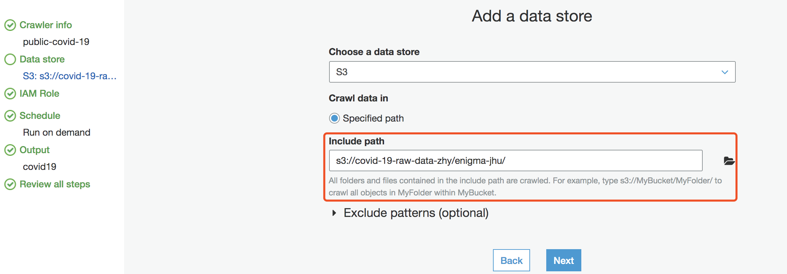
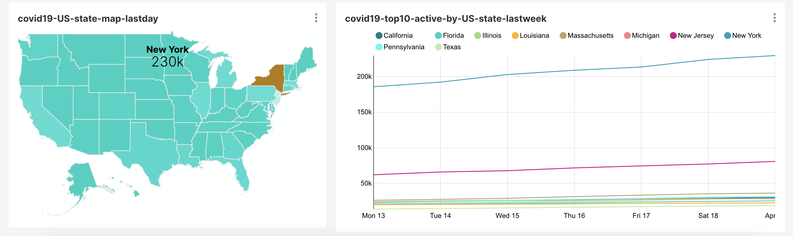

# The public data lake for analysis of COVID-19 data

This data lake is comprised of data in a publicly readable Amazon S3 bucket (s3://covid19-lake). The post shows how to set up the definitions for that data in an AWS Glue Data Catalog to expose it to analytics engines. You can then query the AWS COVID-19 data lake with Amazon Athena, a serverless SQL query engine.

[Offical doc](https://aws.amazon.com/cn/blogs/big-data/a-public-data-lake-for-analysis-of-covid-19-data/)

|Table Name / Bucket Path	| Description	| Sources| Key Field |
| :-----| :-----| :-----| :-----|
|s3://covid19-lake/enigma-jhu/ | Global Coronavirus (COVID-19) Data | Johns Hopkins | Number of confirmed / deaths / recoveries / Geographic location / Date updated

## Browser the data set
```bash
# CLI
aws s3 ls s3://covid19-lake/ --profile us-east-1

# You can also query via the S3 browser
https://github.com/awslabs/aws-js-s3-explorer
```

## Sync the public dataset s3 bucket to your bucket
Use the [amazon-s3-resumable-upload toolkit](https://github.com/aws-samples/amazon-s3-resumable-upload) to sync the public covid19 datalake dataset to your bucket

```bash
git clone git@github.com:aws-samples/amazon-s3-resumable-upload.git
cd amazon-s3-resumable-upload/serverless/enhanced-lambda-jobsender
pip install -r requirements.txt

export AWS_DEFAULT_REGION=us-east-1

## System Manager Parameter Store create new parameter：Name: s3_migration_credentials, Tier: Standard, Type: SecureString
{
  "aws_access_key_id": "your_aws_access_key_id",
  "aws_secret_access_key": "your_aws_secret_access_key",
  "region": "cn-northwest-1"
}

## Edit AWS CDK app.py Define bucket parameter before deploy CDK
bucket_para = [{
    "src_bucket": "covid19-lake",  # The bucket in US
    "src_prefix": "enigma-jhu",
    "des_bucket": "covid-19-raw-data-zhy", # The bucket in China
    "des_prefix": ""
}, {
    "src_bucket": "covid19-lake",  # The bucket in US
    "src_prefix": "enigma-jhu-timeseries",
    "des_bucket": "covid-19-raw-data-zhy",  # The bucket in China
    "des_prefix": ""
}, {
    "src_bucket": "covid19-lake",
    "src_prefix": "static-datasets",
    "des_bucket": "covid-19-raw-data-zhy",
    "des_prefix": ""
}]

StorageClass = 'STANDARD'
alarm_email = "alarm_your_email@email.com"

# Deploy jobsender to scan source and destination bucket and create the job to SQS
cdk deploy --profile ${AWS_GLOBAL_PROFILE} --outputs-file "stack-outputs.json"
```

## Exploring the data through the Glue Data Catalog
### Create a Glue Crawlers to populate the AWS Glue Data Catalog with tables automatically

1. Follow up the guide [Congfiure Glue Crawlers](https://docs.aws.amazon.com/glue/latest/dg/crawler-configuration.html) to create a Glue Crawlers named `public-covid-19` 

- Configure the datastore point to the S3 bucket `covid-19-raw-data-zhy`


- Configure the output as `covid19` database table

Note: `Create a single schema for each S3 path` as `true`


- Overview of `public-covid-19` crawler


2. Run the `public-covid-19` crawler

- Select `public-covid-19` crawler and click `Run Crawler`
- The crawler status change to `Starting`
- Wait the crawler complete execution and status change back to `Ready`
- Crawler "public-covid-19" completed and created 2 tables under database `covid19`


### Check the data catalog generated by Glue Crawler

For example, the following screenshot shows the metadata of the table containing COVID-19 Global Data from Johns Hopkins.

The enigma-jhu data table tracks confirmed, recoveries, deaths COVID-19 cases in provinces, states, and countries across the world with a breakdown to the county level in the US.


## Create a Glue ETL job convert Json to Parquet format 
To improve the query performance and save cost I will create a Glue ETL job convert Json to Apache Parquet format

1. Add Job from Glue -> ETL, Job Name as `covid19_json2parquet`, make sure enable `Job bookmark`


2. Select `covid19.enigma_jhu_json` table as data source


3. Create a new table which point to S3 location as s3://covid-19-output-data-zhy/enigma_jhu_parquet


4. The ETL job just map all fields of json format to Parquet format just convert the `last_update` field to timestamp type


5. Run the job and make sure the execution finished successfully.

## Querying data via Amazon Athena

- The query returns the total confirmed cases broken down by county_region filter by time

```sql
-- 2020-04-19 total confirmed, recovered, deaths, active
SELECT
    SUM(confirmed) as total_confirmed, SUM(recovered) as total_recovered, SUM(deaths) as total_deaths, SUM (confirmed-recovered-deaths) as total_active
FROM 
    "covid19"."enigma_jhu_parquet"
WHERE
    date(last_update) = date('2020-04-19');
    
-- 2020-04-19 with confirmed, recovered, deaths, active group by country_region queryed against parquet format data
SELECT
    SUM(confirmed) as total_confirmed, SUM(recovered) as total_recovered, SUM(deaths) as total_deaths, SUM (confirmed-recovered-deaths) as total_active, country_region
FROM 
    "covid19"."enigma_jhu_parquet"
WHERE
    date(last_update) = date('2020-04-19')
GROUP BY country_region ORDER BY total_confirmed DESC;

-- 2020-04-17 with confirmed, recovered, deaths, active group by country_region queryed against json format data
SELECT 
    SUM(confirmed) as total_confirmed, SUM(recovered) as total_recovered, SUM(deaths) as total_deaths, SUM (confirmed-recovered-deaths) as total_active
FROM 
    "covid19"."enigma_jhu_json"
WHERE
    cast(from_iso8601_timestamp(last_update) as date) = date('2020-04-19')
GROUP BY country_region ORDER BY total_confirmed DESC ;
```

- The query returns the growth of confirmed cases for the past 7 days broken down by US county

```sql
SELECT 
    fips, admin2, province_state, confirmed, 
      last_value(confirmed) over (partition by fips order by last_update) - first_value(confirmed) over (partition by fips order by last_update) as growth_count,
      first_value(last_update) over (partition by fips order by last_update desc) as most_recent,
      last_update
FROM  
    "covid19"."enigma_jhu_parquet"
WHERE 
    last_update > now() - interval '7' day AND country_region = 'US'
```

## Virtualization Dashboard by Superset
### Prepare table date source
- Superset `World_Map` Chart can not identify the `US` as `United States` so I did name conversion.
- I aslo calculate the active column
```sql
CREATE TABLE enigma_jhu_parquet_country as 
  SELECT "fips", "admin2", "province_state", 
      CASE "country_region"
      WHEN 'US' THEN 'United States'
      -- ...any other translation you would like to add here
      ELSE "country_region"
      END AS "country_region",
      "combined_key", "last_update", "latitude", "longitude", 
      "confirmed", "deaths", "recovered", (confirmed-recovered-deaths) as "active"
from (
select t.*
from "covid19"."enigma_jhu_parquet" t)
```

- Superset `Country_Map` Chart required `ISO 3166-2 codes of region/province/department`, so I created the conversion for `United States` broken down
```sql
CREATE TABLE enigma_jhu_parquet_state as 
  SELECT "fips", "admin2", "province_state", 
      CASE "country_region"
      WHEN 'US' THEN 'United States'
      -- ...any other translation you would like to add here
      ELSE "country_region"
      END AS "country_region",
      "last_update", "latitude", "longitude", 
      "us_state_confirmed", "us_state_deaths", "us_state_recovered", (us_state_confirmed-us_state_recovered-us_state_deaths) as "us_state_active",
      concat('US-',"abbreviation") as "us_state_abbreviation"
from (
SELECT t.fips, t.admin2, t.province_state, t.country_region, t.last_update, t.latitude, t.longitude, last_value(t.confirmed) over (partition by t.fips order by t.last_update) as us_state_confirmed, last_value(t.deaths) over (partition by t.fips order by t.last_update) as us_state_deaths, last_value(t.recovered) over (partition by t.fips order by t.last_update) as us_state_recovered, s.*
from "covid19"."enigma_jhu_parquet" t, "covid19"."static_datasets_state_abv" s 
where t.province_state = s.state and t.country_region = 'US')

```

### Dashboard example
[Demo dashboad](http://superset-alb-2068535437.cn-northwest-1.elb.amazonaws.com.cn/r/2)
1. The World Confirmed, Recovered, Deaths and Active number in last day


2. World Map for active cases by country in last day and top 30 active number country list in last day


3. Woldwide confirmed and active cases by date in last 90 days


4. United States active case by state in last day and top 10 active number state by date in last week


### Appendix - Superset dashboard query
- covid19-total-confirmed-lastday, covid19-total-recovered-lastday, covid19-total-deaths-lastday, covid19-total-active-lastday
```sql
SELECT sum("confirmed") AS "sum(confirmed)"
FROM "enigma_jhu_parquet"
WHERE "last_update" >= from_iso8601_timestamp('2020-04-19T00:00:00.000000')
  AND "last_update" < from_iso8601_timestamp('2020-04-20T00:00:00.000000')
ORDER BY "sum(confirmed)" DESC;


SELECT sum("recovered") AS "sum(recovered)"
FROM "enigma_jhu_parquet"
WHERE "last_update" >= from_iso8601_timestamp('2020-04-19T00:00:00.000000')
  AND "last_update" < from_iso8601_timestamp('2020-04-20T00:00:00.000000')
ORDER BY "sum(recovered)" DESC;

SELECT sum("deaths") AS "sum(deaths)"
FROM "enigma_jhu_parquet"
WHERE "last_update" >= from_iso8601_timestamp('2020-04-19T00:00:00.000000')
  AND "last_update" < from_iso8601_timestamp('2020-04-20T00:00:00.000000')
ORDER BY "sum(deaths)" DESC;

SELECT SUM(confirmed-recovered-deaths) AS "sum(confirmed-recovered-deaths)"
FROM "enigma_jhu_parquet"
WHERE "last_update" >= from_iso8601_timestamp('2020-04-19T00:00:00.000000')
  AND "last_update" < from_iso8601_timestamp('2020-04-20T00:00:00.000000')
ORDER BY "sum(confirmed-recovered-deaths)" DESC;
```

- covid19-www-active-map-lastday
```sql
SELECT "country_region" AS "country_region",
       SUM(confirmed-recovered-deaths) AS "sum(confirmed-recovered-deaths)"
FROM "enigma_jhu_parquet_country"
WHERE "last_update" >= from_iso8601_timestamp('2020-04-19T00:00:00.000000')
  AND "last_update" < from_iso8601_timestamp('2020-04-20T00:00:00.000000')
GROUP BY "country_region"
ORDER BY "sum(confirmed-recovered-deaths)" DESC
LIMIT 10000;
```

- covid19-top30-active-by-country-lastday
```sql
SELECT "country_region" AS "country_region",
       sum("active") AS "sum(active)",
       sum("recovered") AS "sum(recovered)",
       sum("deaths") AS "sum(deaths)"
FROM "enigma_jhu_parquet_country"
WHERE "last_update" >= from_iso8601_timestamp('2020-04-19T00:00:00.000000')
  AND "last_update" < from_iso8601_timestamp('2020-04-20T00:00:00.000000')
GROUP BY "country_region"
ORDER BY "sum(active)" DESC
LIMIT 30;
```

- covid19-www-confirmed-active-by-date-last90days
```sql
SELECT date_trunc('day', CAST("last_update" AS TIMESTAMP)) AS "__timestamp",
       sum("active") AS "sum(active)",
       sum("confirmed") AS "sum(confirmed)"
FROM "enigma_jhu_parquet_country"
WHERE "last_update" >= from_iso8601_timestamp('2020-01-21T00:00:00.000000')
  AND "last_update" < from_iso8601_timestamp('2020-04-20T00:00:00.000000')
GROUP BY date_trunc('day', CAST("last_update" AS TIMESTAMP))
ORDER BY "sum(active)" DESC
LIMIT 50000;
```

- covid19-US-state-map-lastday
```sql
SELECT "us_state_abbreviation" AS "us_state_abbreviation",
       sum("us_state_active") AS "sum(us_state_active)"
FROM "enigma_jhu_parquet_state"
WHERE "last_update" >= from_iso8601_timestamp('2020-04-19T00:00:00.000000')
  AND "last_update" < from_iso8601_timestamp('2020-04-20T00:00:00.000000')
  AND "country_region" = 'United States'
GROUP BY "us_state_abbreviation"
ORDER BY "sum(us_state_active)" DESC
LIMIT 50000;
```

- covid19-top10-active-by-US-state-lastweek	
```sql
SELECT "province_state" AS "province_state",
       date_trunc('day', CAST("last_update" AS TIMESTAMP)) AS "__timestamp",
       sum("us_state_active") AS "sum(us_state_active)"
FROM "enigma_jhu_parquet_state"
JOIN
  (SELECT "province_state" AS "province_state__",
          sum("us_state_active") AS "mme_inner__"
   FROM "enigma_jhu_parquet_state"
   WHERE "country_region" = 'United States'
     AND "last_update" >= from_iso8601_timestamp('2020-04-13T00:00:00.000000')
     AND "last_update" < from_iso8601_timestamp('2020-04-20T00:00:00.000000')
   GROUP BY "province_state"
   ORDER BY "mme_inner__" DESC
   LIMIT 10) AS "anon_1" ON "province_state" = "province_state__"
WHERE "last_update" >= from_iso8601_timestamp('2020-04-13T00:00:00.000000')
  AND "last_update" < from_iso8601_timestamp('2020-04-20T00:00:00.000000')
  AND "country_region" = 'United States'
GROUP BY "province_state",
         date_trunc('day', CAST("last_update" AS TIMESTAMP))
ORDER BY "sum(us_state_active)" DESC
LIMIT 100;
```
