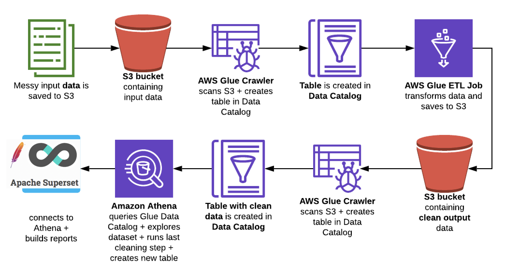

# COVID-19: End-To-End Analytics With AWS Glue, Athena And Superset

## Introduction
Build a pipeline for open COVID-19 dataset. The dataset from [corona-virus-report](https://www.kaggle.com/imdevskp/corona-virus-report). It shows the cumulative confirmed, recovered and deaths figures by day, country and province. Latitude and longitude coordinates are also added at the country level. The pipeline complete the ETL of raw data and give visualization of entire world spread.

**The pipeline as below**
1. Save messed-up dataset to the covid-19-raw-data S3 bucket.
2. Run the AWS Glue Crawler on covid-19-raw-data S3 bucket to parse JSONs and create the covid-19-raw-data table in the Glue Data Catalog.
3. Run the Glue ETL Job on covid-19-raw-data table to:
- clean the data
- save ETL JSON result to the covid_19_output_data S3 bucket.
4. Run the AWS Glue Crawler on covid-19-output-data S3 bucket to parse JSONs and create the covid-19-output-data table in the Glue Data Catalog.
5. Query the covid-19-output-data table in Amazon Athena. Remove duplicates and create the final covid19_app_data_athena table in the Glue Data Catalog.
6. Connect [Apache Superset](https://github.com/apache/incubator-superset) to the covid19_app_data_athena table and build visualization dashboard.

## Detail step by step guide
- [Install and Configure Superset](Install_Superset.md)
- [PyAthena Pyathenajdbc Update for China](Athena-Superset-China.md)
- [Covid_19_ETL step by step guide](Covid_19_ETL.md)
- [The public data lake for analysis of COVID-19 data](Public-Covid19-Datalake.md)
- [用于分析新冠肺炎 COVID-19 的 AWS 公共数据湖示例](Public-Covid19-Datalake-cn.md)
- [Apache Superset LDAP authentication with Active Directory]()

## Reference
[covid-19-end-to-end-analytics-with-aws-glue-athena-and-quicksight](https://francescopochetti.com/covid-19-end-to-end-analytics-with-aws-glue-athena-and-quicksight/)
[A public data lake for analysis of COVID-19 data](https://aws.amazon.com/blogs/big-data/a-public-data-lake-for-analysis-of-covid-19-data/)
